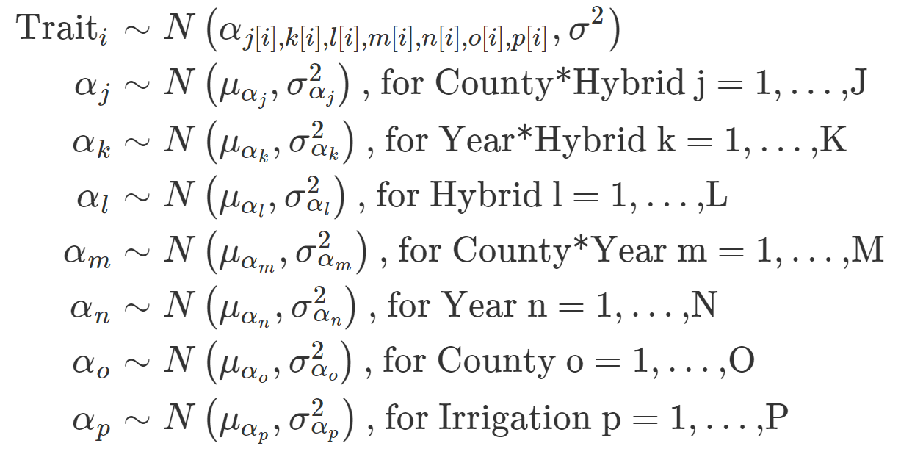
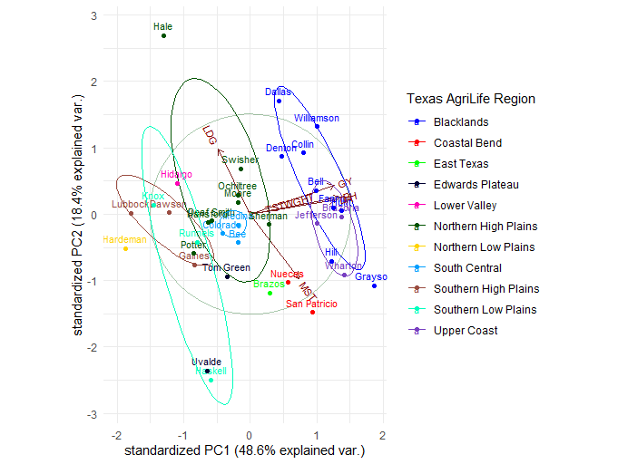

### Texas Production Regions

Further analysis can be conducted for this dataset with an all-random linear model accounting for the following effects and fit to the traits that serve as measures of hybrid performance (Grain yield, Plant height, Days to Flowering, Testweight, Moisture, and Lodging). 

Following the linear model analysis, a nonlinear iterative partial least squares (nipals) principal component analysis (pca) was applied to the best linear unbiased predictions attributable to counties to cluster counties with similar environmental effects on hybrid performance. The NIPALS PCA was implemented using the `pcaMethods` package in R.

