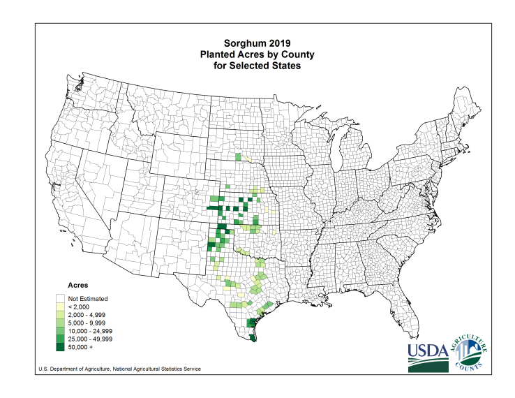
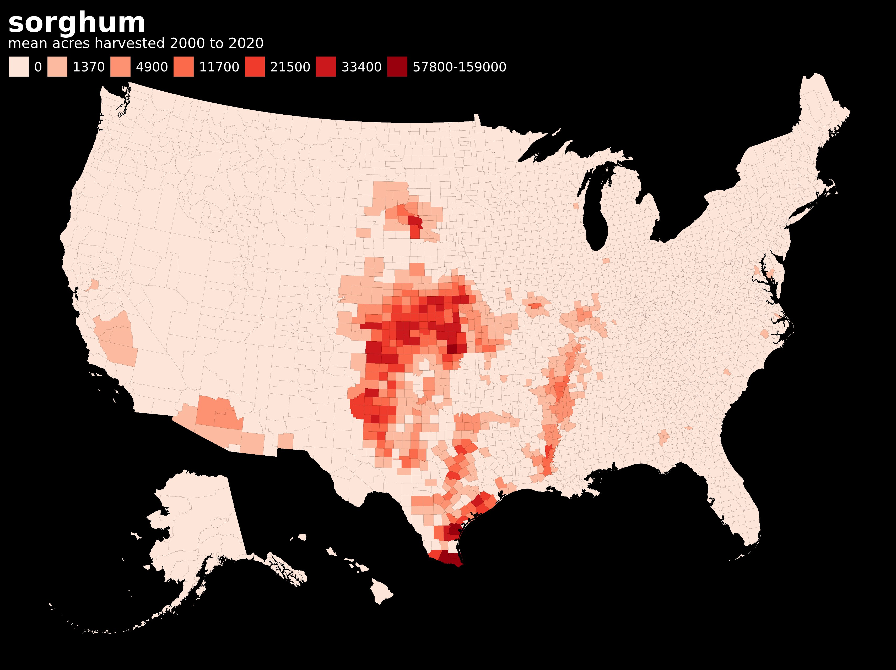
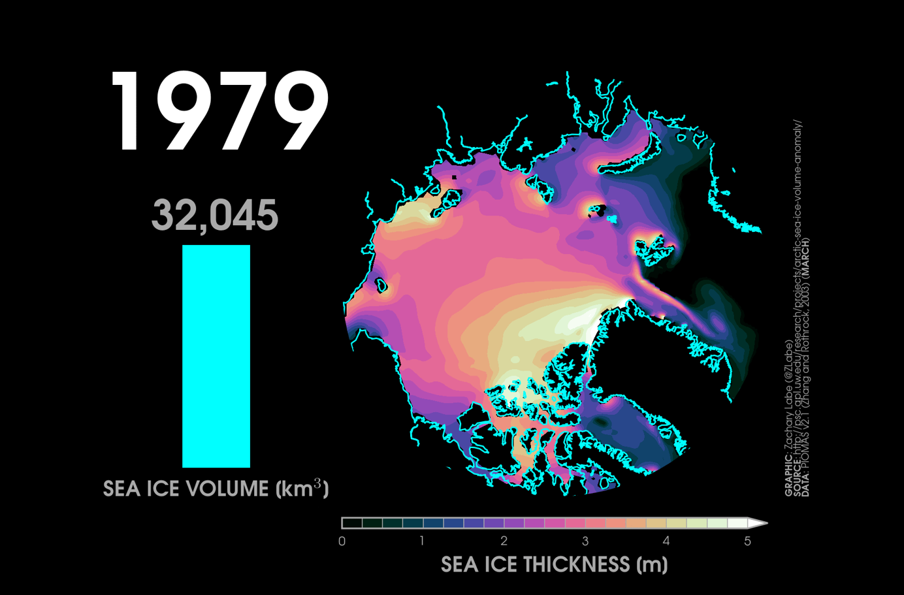
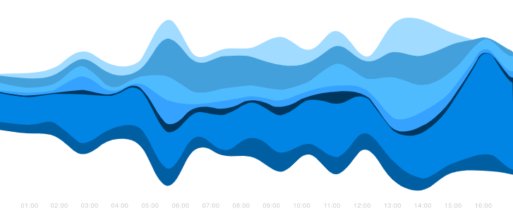
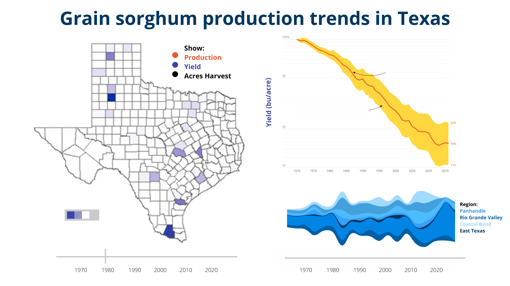

#### Introduction
Sorghum [Sorghum *bicolor* (L. Moench)] is the world's fifth most important cereal crop, in terms of both production and area planted. It is an increasingly relevant grain crop due to its resilience to drier and hotter climates. In the United States, sorghum is typically grown in dryland areas from South Dakota to South Texas and Texas accounts for ~1.8 million of the United States' ~5.8 million acres of sorghum production. 

The idea for this visualization project is to use the [Texas A&M Variety Testing](http://varietytesting.tamu.edu/grainsorghum/) and [USDA NASS](https://quickstats.nass.usda.gov/) data repositories on [grain sorghum](https://www.sorghumcheckoff.com/sorghum-101/) production to visualize yield and production trends for the state of Texas.

#### Datasets
For this project we plan to primarily use two main datasets. The first is the TAES dataset from Texas A&M Agrilife, which contains data from 2021 Texas Sorghum Variety Trials. The second is the dataset from the USDA National Agricultural Statistics website. This database is useful because we can select national data for different time periods, counties, etc.

**TAES Dataset:**
The TAES dataset contains data from multi-environment trials of commercially released sorghum hybrids grown from 1970-2021 across different counties/cities around Texas.

Characteristics/Attributes:
This dataset is extensive and has 50+ columns describing hybrid sorghum performance and the management practices used to grow each trial. Some important variables include...  

* Year - Year survey data point was obtained
* County - Texas County Name
* Hybrid - Specific sorghum genotype
* Irrigation - Irrigation level/amount
* Brand - Company brand of sorghum plant/seed
* Herbicide - Substances used to protect crop 
* Phosphorus - amount of phosphorus applied in fertilizer
* Nitrogen - amount of nitrogen applied in fertilizer
* Potassium - amount of potassium applied in fertilizer

Other less ancillary variables...  

* Avg % Bird Damage - average percentage of crop lost due to birds
* Avg pH - average amount of acidity in the field

At first glance, we have determined that these columns possibly hold interesting data/insights. What our team deems important may change in the future as this project progresses.

**USDA Dataset:**
This database is more queryable and contains additional information on not only sorghum but other crops as well. 
Characteristics/Attributes:

* Year - Year survey data point was obtained.
* County - Texas county name
* Commodity - Type of crop
* Value - Measure of crop peroformance (yield, area harvested, etc.)
* CV(%) - The coefficient of variation

As in the former dataset, important variables may change as we explore the data further.

#### Story:
Audience: Farmers, Students, Agricultural institutions.  
Attributes: See dataset descriptions above.
Metrics: Correlations (X vs Y), linear regressions, error calculations, future crop yield/outputs.

Questions:

* What are the most important factors that contribute to sorghum crop yield in the counties of Texas?
* How has sorghum production and performance changed over time?
* What variables have caused this change?
* Where have these changes taken place?
* Is there any management or environmental consideration we can recommend to achieve higher yields?

#### Inspiration

First, there already exists at least two examples of mapping the county-level production of sorghum acres.
The [USDA National Agricultural Statistics Service's](https://www.nass.usda.gov/Charts_and_Maps/Crops_County/index.php) reported maps and [Zachary Stansell](https://twitter.com/ZacharyStansell/status/1354612264679198722)'s [tool](https://gist.github.com/zacharystansell/fd1ebd6e3cda8a175680b78a4b271497) to map USDA crop data which uses [these APIs](https://sheilasaia.rbind.io/post/2020-06-30-nass-api-part2/). 

 {width=36%}

Further, we are motivated to go beyond a static map and create a dynamic choropleth map like Zachary Labe's depiction of Arctic Sea Ice Volume/Thickness. This is a standstill image from a moving gif but an interactive approach could allow us to slide through years and see the changing geographic heat map of Texas' grain sorghum trends. Lastly, the regions of texas could provide the categories for a stream graph depicting a variable's distribution over the years. 

{width=40%} {width=40%} 

#### Sketch

