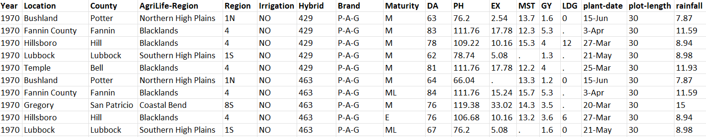

## Data Sources & Extraction

#### Texas A&M AgriLife Research (TXAR)
Texas A&M AgriLife Research conducts the grain sorghum performance tests each year to provide
growers in Texas with accurate and unbiased information on hybrid performance at locations
across the state. For producers, the selection of superior hybrids that are well adapted for a given region is essential
for maximizing yield and profit. The TAES dataset contains data from multi-environment trials of commercially released sorghum hybrids grown from 1970-2021 across different counties/cities around Texas.

Characteristics/Attributes:
This dataset is extensive and has 50+ columns describing hybrid sorghum performance and the management practices used to grow each trial. Some important variables include:  

* Year - Year survey data point was obtained
* County - Texas County Name
* Hybrid - Specific sorghum genotype
* Irrigation - Irrigation level/amount
* Brand - Company brand of sorghum plant/seed

Response variables that we are interested in visualizing include many agronomically relevant traits included in the dataset:

* Grain Yield 
* Plant height 
* Days to Flowering 
* Testweight

These data were extracted from both TXAR publications by the TXAR sorghum breeding program and more recently, provided directly by the variety testing program from their non-public database.

#### United States Department of Agriculture (USDA)
The USDA's National Agricultural Statistics Service (NASS) conducts hundreds of surveys every year and prepares reports covering virtually every aspect of U.S. agriculture. Production of grain sorghum, prices paid and received by farmers, farm labor and wages, farm finances, chemical use, and changes in the demographics of U.S. producers are available and can be downloaded as CSV tables. The main variable that we are interested in visualizing with this dataset is grain yield, with years, locations, and agronomic practices also contributing to this metric.

## Transformation

#### Texas A&M AgriLife Research (TXAR)

The TXAR dataset includes fields where notes were taken in paragraph form and do not numerically quantify much useful information. These need to be excluded from the final dataset we will use. Similarly, we must delete certain columns that have too much missing data to be useful. These data columns include: Avg % Bird Damage, Avg % Midge Damage, Avg Iron Chlorosis,	Avg Weathering, Avg Smut, Avg Stand, Avg Plant Population, Avg HeadsPerAcre, Sulfur (lb/ac),	Zinc (lb/ac). Additionally, the variables in all remaining columns must be converted to units in the metric system for consistency in analysis and visualization. Finally, the dataset includes some observations from Curry County, New Mexico and since we are only interested in Texas, we will exclude these data.

#### United States Department of Agriculture (USDA)

The CSV file of the USDA NASS dataset also comes with unnecessary variables that contain some organizational or metadata that aid the USDA programs but mean very little to our analysis. These variables include: Week Ending, State ANSI, Geo Level, and Domain Category. Other variables are entirely empty despite being included in the dataset, so these must also be excluded: Zip Code, Region, watershed code, Watershed.


# Final Data

#### Texas A&M AgriLife Research (30,330 observations of 30 variables)  


#### United States Department of Agriculture (7,957 observations of 11 variables)    


Both datasets will remain as csv files for easy loading into the R environment. 


``` {r, echo = FALSE}
TXAR = read.csv("data/TXAR_data.csv")

USDA = read.csv("data/USDA_data.csv")

```

