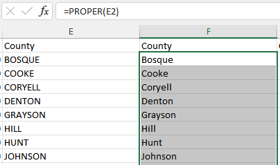
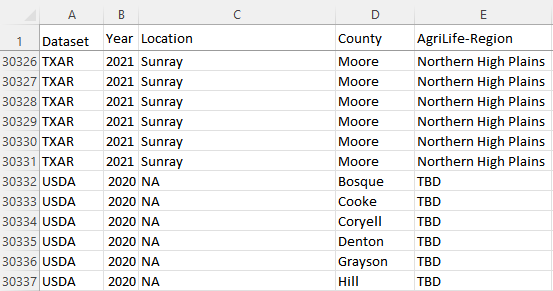
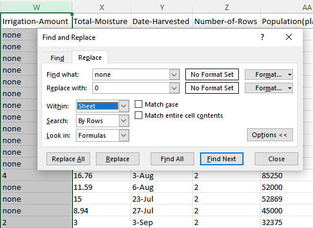

```{r setup, include=FALSE} 
knitr::opts_chunk$set(warning = FALSE, message = FALSE) 
```

### Merging datasets: Year and County 

To start the data enrichment phase of the project, we joined our sources according to year and county columns. While the two datasets are from distinct sources and for separate uses, it may prove useful to have to load only one csv file into the R environment. 

USDA dataset's county names were in all-caps so they needed to be renamed to change that. This was easily carried out using the Find and Replace feature in Excel.  

{width=50%}

Once this was changed, we could bind the two datasets that shared similarly coded counties.  

{width=50%}


### TX AgriLife Regions vs USDA Districts

The two datasets each included a Region column that were slightly different. We selected the Texas AgriLife regional distinctions as our chosen delineation for Texas Counties. The USDA region column was removed.

### Adding geographic detail such as latitude and longitude
Latitude and longitude data were sourced using the geocode() function in the 'tidygeocoder' package and the Nominatim (“osm”) geocoding service.

```{r, echo=FALSE}
library(tidyverse, warn.conflicts = FALSE)
df = read_csv("data/Final_data.csv")
df = df[-which(df$County == "Other (Combined) Counties"),]
countylist = as.data.frame(unique(df$County))
colnames(countylist) = "County"


library(tidygeocoder, warn.conflicts = FALSE)
library(dplyr, warn.conflicts = FALSE)

lat_longs <- countylist %>%
  geocode(county = County, method = 'osm', lat = latitude , long = longitude)

head(lat_longs)

# library(ggplot2)

# ggplot(lat_longs, aes(longitude, latitude), color = "grey99") +
#  borders("state") + geom_point() +
#  ggrepel::geom_label_repel(aes(label = County)) +
#  theme_void()


```

### Irrigation: Coding and Variable Type

Lastly, we converted irrigation quantity data column observations from "none" to "0" and made the column an entirely numerical variable.  

{width=50%}


