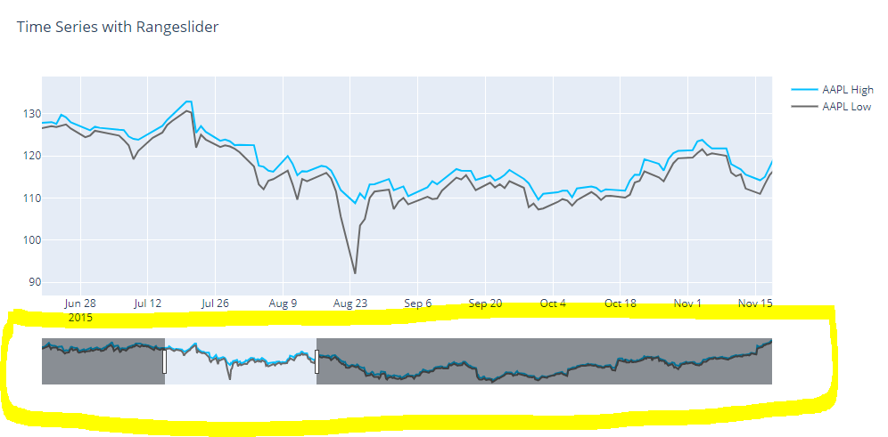
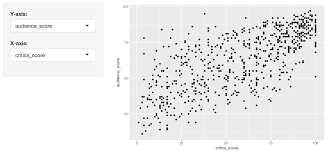
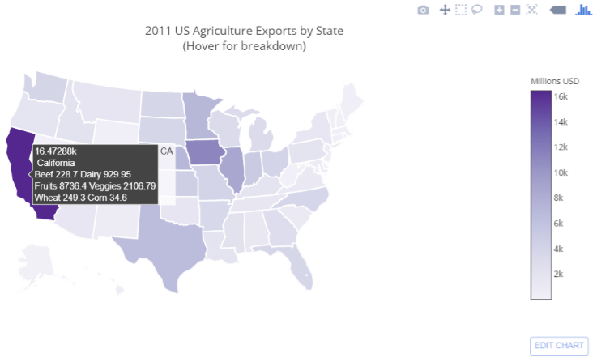
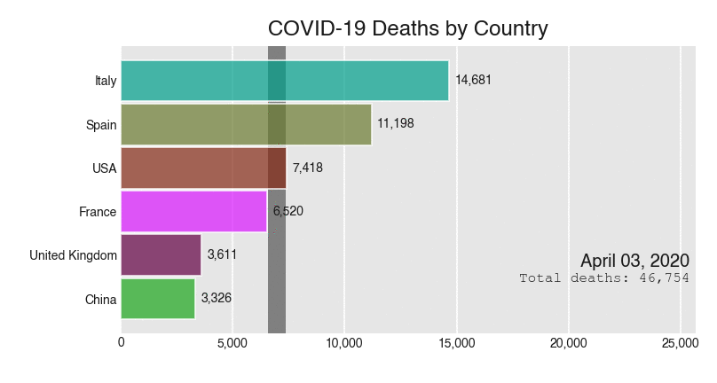

<!-- Changing the fonts and style to fit more into less pages -->

<style type="text/css">

body{ /* Normal  */
      font-size: 12px;
  }
td {  /* Table  */
  font-size: 8px;
}
h1.title {
  font-size: 18px;
  color: Black;
}
h1 { /* Header 1 */
  font-size: 18px;
  color: Black;
}
h2 { /* Header 2 */
    font-size: 16px;
  color: Black;
}
h3 { /* Header 3 */
  font-size: 14px;
  font-family: "Times New Roman", Times, serif;
  color: Black;
}
code.r{ /* Code block */
    font-size: 12px;
}
pre { /* Code block - determines code spacing between lines */
    font-size: 14px;
}
h4.author {
  font-size: 12px;
  color: DarkBlue;
}
</style>

<!-- ## Grading Rubric -->

<!-- Create a list of the interactions you will accommodate in your final project.  Ideally, you should have a good idea of how people will interact with your dashboard/project and the affordances and limitations of your interactions.   -->

<!-- This should include a description of each interaction - for example, what events will trigger, how will the interaction change the data - we don't have to know how to do everything yet - but just an idea of sample scenarios of how users can interact with your project.  -->

<!-- Submit one pdf per group. -->


<!-- Begin document -->

```{r setup, include=FALSE}
knitr::opts_chunk$set(echo = TRUE)
```

# Range slider

Line Graph with range slider to see how sorghum yields(y-axis) changed over time and what time periods saw the greatest increases in yield. Users can interact and more closely inspect the data by specifying year ranges(x-axis). A wider range will include more data, while a shorter range will restrict the data. This will be used when the user wants to examine a limited time range of the data.

<center>
{width=50%}
</center>


# Interactive Variable Selection for Scatterplot

A drop-down menu with variables (yield, plant height, excertion, etc.) can be selected to have an interactive scatterplot window that plots and additionally displays pearson’s R. It is used to see correlation/relationship between variables. Based on user selections the scatterplot shown will change.

<center>
{width=50%}
</center>

# Hover Information

Chloropleth map of average yields per county will be displayed. Upon hovering over a county, the county name and average yield for that county will be shown. This will be used when the user wants to examine the specifics for any particular county.

<center>
{width=50%}
</center>

# Animation - Racing bar graph

To visualize the accumulation of hybrids(x-axis) from each brand(y-axis) over the years. This will be used when the user wants to see changes over time between the relationship of hybrid accumulation and brand name. As the time series continues on brand names may switch positions based on their respective number of hybrids.

<center>
{width=50%}
</center>


