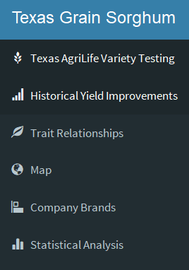
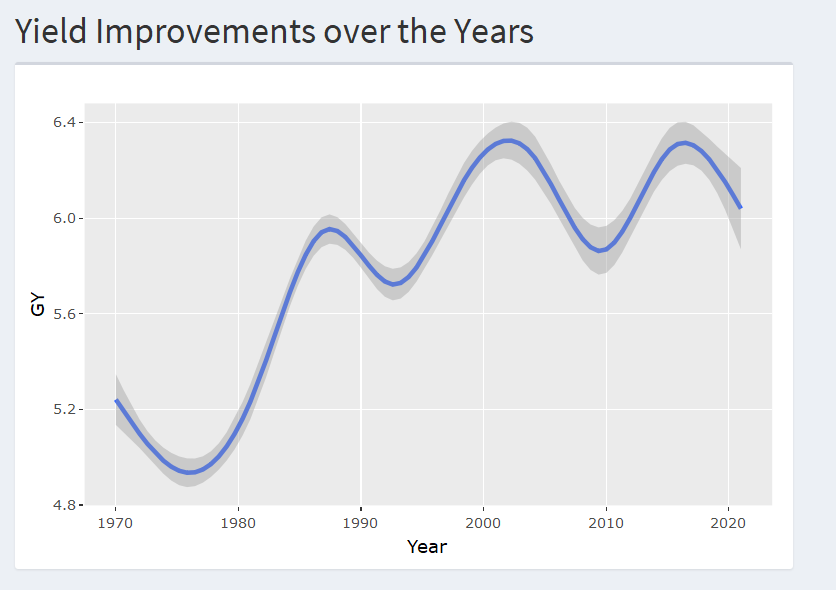
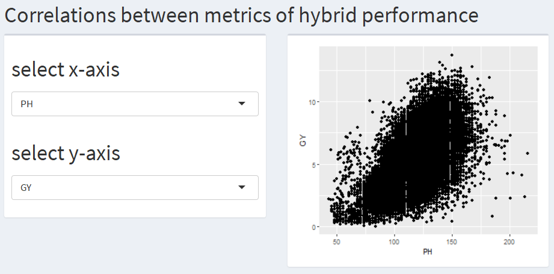
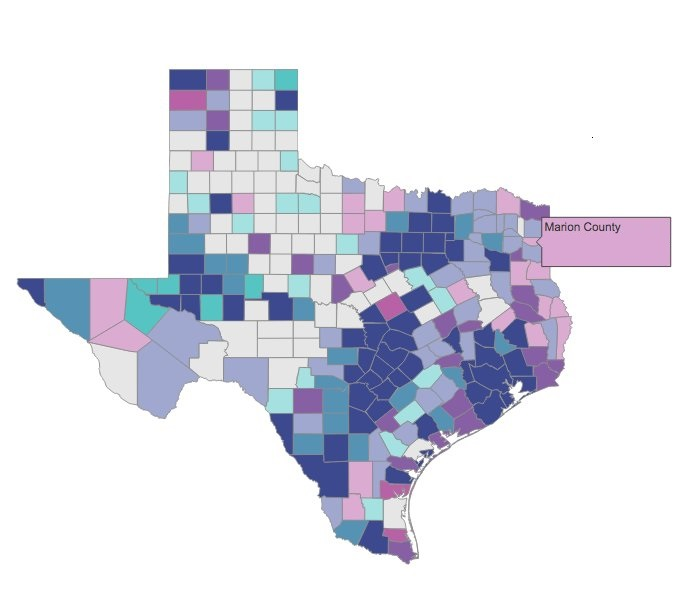
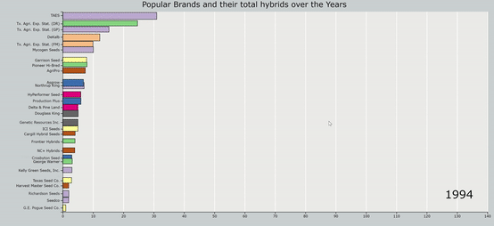
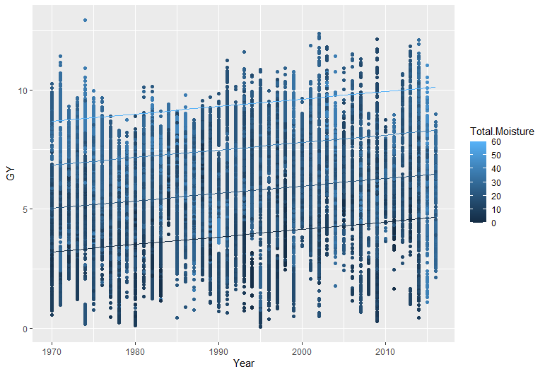

<!-- Changing the fonts and style to fit more into less pages -->

<!-- ## Grading Rubric -->
<!-- 3 pages maximum -->
<!-- take inspiration from your project pitch -->

<!-- choose 4-6 chart types to showcase, make these as interactive as possible. one of these should be a predictive graph. -->
<!-- one of these should be a map of spatial components. -->

<!-- outline the 5 storypoints -->

<!-- Provide a clear description of why these visualizations are appropriate for your data using RMarkdown report not to exceed 3 pages (including visuals)  -->

<!-- Begin document -->

# Introduction

Our project attempts to derive meaningful insights from grain sorghum production data in Texas. Grain sorghum is the fifth most important cereal crop and accounts for ~2 million acres of Texas farmland. The United States is the world's leading producer of sorghum despite sorghum being grown primarily in poor environments which are prone to heat and drought. This is because sorghum is more resilient to poor conditions and drought tolerant than alternative crops like corn. Sorghum will become an increasingly important crop under evolving climate change scenarios in Texas and other semiarid/arid regions of the world. Visualizing the yield performance of the diverse climates in Texas could provide valuable insights on the success of certain hybrids and management practices. 

We utilize information from two sources for our visualizations. The first is compiled from the Texas AgriLife Crop Testing agency's (TXAR) annual variety testing of new hybrids which the seed industry submit for evaluation in relevant production regions. TXAR publish the results as an unbiased report of different company's hybrid products. The second source is the United States Department of Agriculture (USDA) National Agricultural Statistics Service's (NASS) official survey of average crop yields per county. 

# Dashboard Outline

{width=20%}

## Historical Yield Improvements - Line Graph

In the Historical Yield Improvements tab, we visualize how elite hybrids' average sorghum yields have changed over time and what time periods saw the greatest increases in yield from the TXAR data. This analysis is presented as a line graph with range sliders for ineteractive selection of a particular time period.

{width=20%}

## Traits Relationships - Scatterplot
A scatterplot will be presented in the Traits Relationships tab. This visualization consists of an interactive scatterplot window that plots and displays pearson’s R for whichever two variables the user selects from a drop down menu of relevant agronomic traits like yield, plant height, exsertion, days to flowering, etc. This is carried out using the TXAR dataset of elite hybrids and can be used to visualize trait relationships in elite sorghum hybrids. 

{width=20%}

## Map - Choropleth Map
This analysis will consist of a Chloropleth Map of average yields per county from the USDA data. The map would be dynamic and allow the person to hover over counties to get more information on the county's yield numbers and the datapoints which led to those figures. There will also be a range slider to change the year that is being visualized.

{width=20%}

## Company Brands - Racing Bar Chart

The dataset is representative of 180 company brands which have produced the ~4000 hybrids in the trials. This animated gif presents which brands were most profilic in releasing these hybrids over the years by allowing us to see the accumulation of hybrids from each brand over the years.

{width=50%}

## Statistical Analysis

In this tab, we attempt to understand what environmental or management factors affect sorghum yields via a linear mixed model analysis with explanatory variables fitted to yield as follows: 

$$
Yield = Location + Year + Hybrid + Hybrid*Location + Irrigation + Previous Crop + Rainfall + Planting Density 
$$

Significance of the effects and the variance explained by the predictor variables will be reported with an *ANOVA* table. The model will then be plotted as a *scatterplots* to visualize the effects and their interactions. The linear mixed model framework is justified since many of the environmental and management factors have the potential for second or third order interactions and will need to be evaluated for their contributions to yield variation.

{width=40%}

