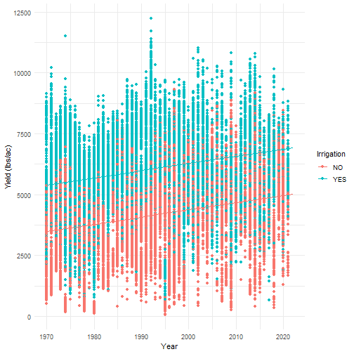
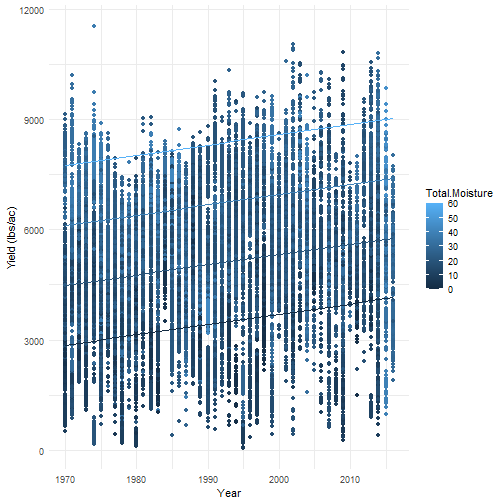
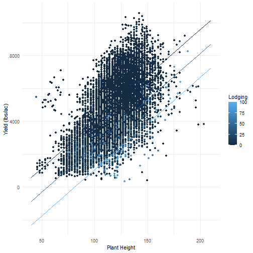
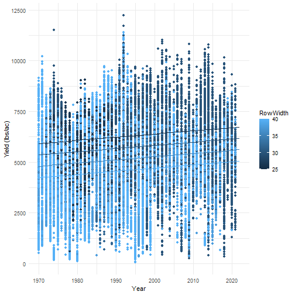
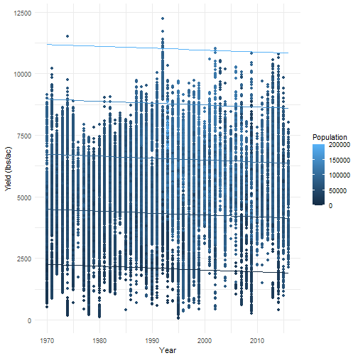

######  For grain sorghum to achieve maximal yields many factors must contribute and interact favorably. To better understand the effects of environmental factors, cultural practices, and genetics, we can model the yields of Texas AgriLife trials against these factors. 

##### Water Availability

###### The preeminent environmental effect on sorghum production is typically the amount of available water throughout the the crop's growing season. Sorghum is a relatively drought tolerant crop that is usually placed in areas with chances of moisture. Rainfall (cm) and irrigation (cm) both contribute to total available moisture in the field. 

##### Lodging   

###### Lodging refers to the permanent displacement of aboveground portions of crops from their vertical stance due to stem buckling (stem lodging) or failure of the root–soil anchorage system (root lodging). Lodging is a concern for producers who fear taller hybrids may fall over and thus decrease yields. 

##### Cultural Practices

###### Farming practices evolve over time to achieve maximal yields with changing genetic and environmental factors. Row spacing (inches) along with Population (plants/acre) determine the crop arrangement in a field, altering how fast the crop canopy closes (leaves from adjoining rows begin overlapping) and the ways in which weeds grow between crop rows.

